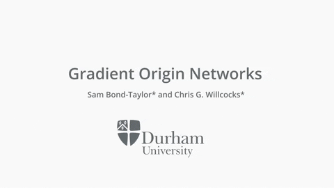

# Gradient Origin Networks

This paper has been accepted at ICLR 2021.

This paper proposes a new type of generative model that is able to quickly learn a latent representation without an encoder. This is achieved using empirical Bayes to calculate the expectation of the posterior, which is implemented by initialising a latent vector with zeros, then using the gradient of the log-likelihood of the data with respect to this zero vector as new latent points. The approach has similar characteristics to autoencoders, but with a simpler architecture, and is demonstrated in a variational autoencoder equivalent that permits sampling. This also allows implicit representation networks to learn a space of implicit functions without requiring a hypernetwork, retaining their representation advantages across datasets. The experiments show that the proposed method converges faster, with significantly lower reconstruction error than autoencoders, while requiring half the parameters.

[](https://colab.research.google.com/gist/samb-t/fbac83a2ec9312616ed61cd74dac50ce/gon.ipynb) **(GON)** <br>

[](https://colab.research.google.com/gist/samb-t/5181643d0a5aeef7830b50dc4e84f659/variational-gon.ipynb) **(Variational GON)** <br>

[](https://colab.research.google.com/gist/cwkx/8c3a8b514f3bdfe123edc3bb0e6b7eca/gon.ipynb) **(Implicit GON)**<br>

The code is available in [GON.py](GON.py) and licensed under the MIT license. For more information, please visit the [Project Page](https://cwkx.github.io/data/GON/). Here is a [link to the paper](https://arxiv.org/pdf/2007.02798.pdf). The implicit GON version uses a SIREN (*Implicit Neural Representations with Periodic Activation Functions*, Sitzmann et al., 2020).

[](https://www.youtube.com/watch?v=ro7t98Q1gXg)


## Citation
If you find this useful, please cite:
```
@inproceedings{bond2020gradient,
   title     = {Gradient Origin Networks},
   author    = {Sam Bond-Taylor and Chris G. Willcocks},
   booktitle = {International Conference on Learning Representations},
   year      = {2021},
   url       = {https://openreview.net/pdf?id=0O_cQfw6uEh}
}
```
